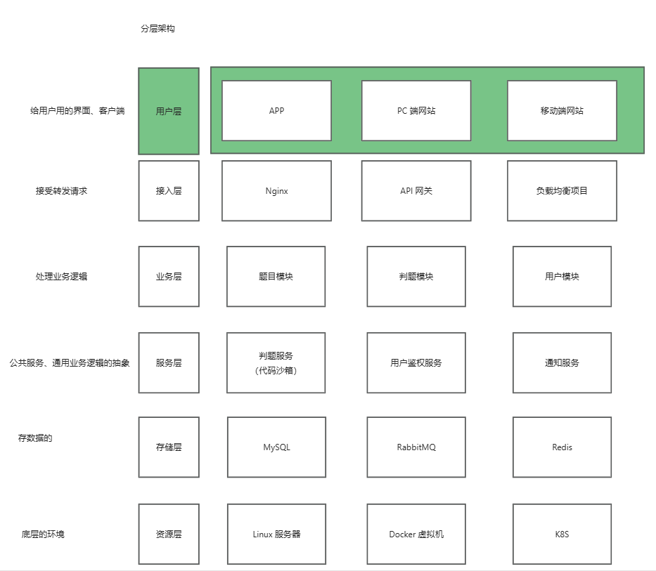
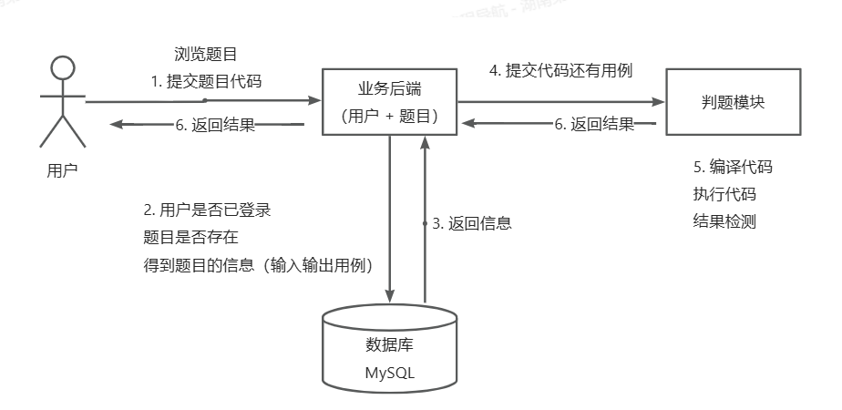
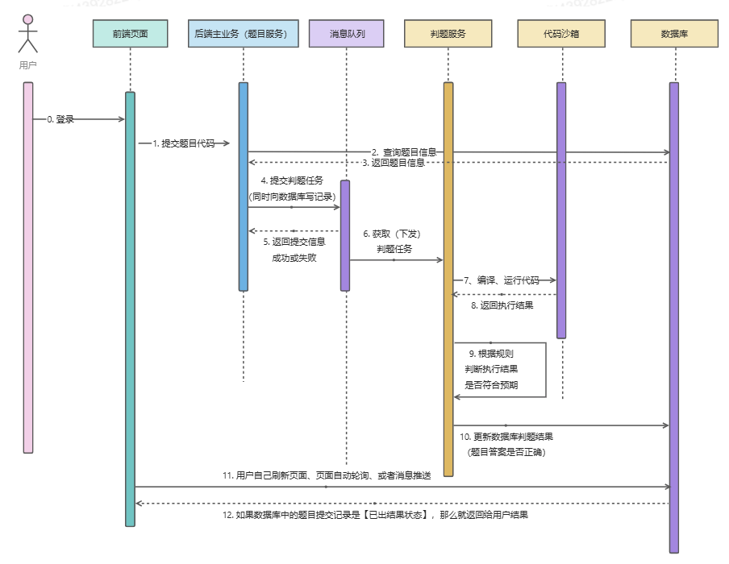

# noj在线判题系统微服务版本

改造前的springboot版：https://github.com/Lynlove/noj-backend

代码沙箱：https://github.com/Lynlove/noj-code-sanbox

## 技术选型
### 前端
- Vue3
- Vue-CLI脚手架
- Vue-Router
- Vuex
- ArcoDesign组件库
- 前端工程化： ESLint+Prettier+Typescript
- Markdown富文本编辑器
- MonacoEditor代码编辑器
- OpenAI前端代码生成
## 后端
- SpringCloud + SpringCloudAlibaba微服务
   - Naco注册中心
   - Gateway网关
   - OpenFeign远程调用
   - 聚合接口文档
- springboot
- Java进程控制
- Java安全管理器
- Docker代码沙箱实现
- 虚拟机+远程开发
- MySQL数据库
- MyBatisPlus
- Redis分布式session
- RabbitMQ消息队列
- 多种设计模式
   - 策略模式
   - 工厂模式
   - 代理模式
   - 模板方法模式

## 系统架构图

## 功能模块
1. 题目模块
   - 创建题目（管理员）
   - 删除题目（管理员）
   - 修改题目（管理员）
   - 搜索题目（用户）
   - 在线做题
   - 提交题目代码
2. 用户模块
   - 注册
   - 登录
3. 判题模块
   - 提交判题（结果是否正确）
   - 错误处理（内存溢出、安全性、超时）
   - 自主实现代码沙箱（安全沙箱）
   - 开放接口（提供一个独立的新服务）

## 核心业务流程

